## TL;DR

**The Bug:** Domain events in EF Core integration tests were being processed twice.

**The Investigation:** I spent 4 days testing wild theories:

- ❌ Transient DbContext causing interceptor sharing
- ❌ Transaction lifecycle calling interceptors twice
- ❌ ChangeTracker.DetectChanges re-entrancy
- ❌ NpgsqlExecutionStrategy retrying operations

**The Truth:** `WebApplicationFactory` was registering the DbContext configuration twice, creating two interceptor instances. I only found it when I stopped assuming and started enumerating what was _actually_ registered in the test setup.

**The Fix:**

1. Made Onward's `AddDbContext` idempotent (check for existing interceptors before adding)
2. Added deduplication with `HashSet<Guid>` instead of `List<Guid>`

**The Lesson:** Sometimes the simplest explanation (double registration) is the right one. I just won't find it until I've eliminated all the complex ones. Also: stack traces can be misleading when I'm making wrong assumptions.

---

## Introduction

This document chronicles a four-day debugging journey to track down why domain events were being processed twice in an application using the Onward library. What started as a simple "events are duplicating" bug turned into a deep dive through Entity Framework Core's internals, dependency injection scoping, execution strategies, and ultimately led me to an unexpected culprit hiding in the test infrastructure.

**Spoiler:** The issue wasn't where I thought it was. Not even close. I went through four different theories before finding the truth.

## Background: The Onward Library

Onward is an implementation of the Transactional Outbox pattern for Entity Framework Core. It works by:

1. **Extracting domain events** from entities during `SaveChangesAsync`
2. **Persisting events** to an `Events` table within the same database transaction
3. **Processing events** immediately after the transaction commits
4. **Retrying failed events** via a background service

The library uses EF Core's `ISaveChangesInterceptor` to hook into the save pipeline:

```csharp
public class SaveChangesInterceptor<TContext> : ISaveChangesInterceptor
{
    private readonly List<Guid> _added = [];

    public override async ValueTask<InterceptionResult<int>> SavingChangesAsync(...)
    {
        // Extract domain events from entities
        var events = context.ExtractEvents();

        // Add Event entities to ChangeTracker
        context.AddToEvents(events);

        // Track which events we added
        var eventIds = GetAddedEventIds(context);
        _added.AddRange(eventIds);

        return result;
    }

    public override async ValueTask<int> SavedChangesAsync(...)
    {
        // Process all events we tracked
        foreach (var eventId in _added)
        {
            await ProcessEventAsync(eventId, context);
        }

        _added.Clear();
        return result;
    }
}
```

Simple, elegant, and it worked perfectly... until I noticed events were being processed twice in integration tests.

## Day 1: The DbContext Lifetime Rabbit Hole

### Initial Hypothesis: Transient vs Scoped DbContext

Looking at our service registration, I noticed the DbContext was registered as Transient:

```csharp
services.AddDbContext<TContext>(
    optionsAction,
    contextLifetime: ServiceLifetime.Transient,  // <-- Suspicious!
    optionsLifetime: ServiceLifetime.Scoped);
```

**Why Transient DbContext is a Bad Idea:**

Using `ServiceLifetime.Transient` for DbContext is generally considered an anti-pattern for several reasons:

1. **Connection Pool Exhaustion** - Each transient instance creates a new connection lifecycle, potentially exhausting the connection pool under load
2. **Performance Overhead** - Creating and disposing DbContext instances repeatedly adds unnecessary overhead
3. **State Management Issues** - Multiple DbContext instances in the same scope can lead to inconsistent views of entity state
4. **Change Tracking Conflicts** - Two transient contexts might track the same entity differently
5. **Transaction Complexity** - Coordinating transactions across multiple context instances becomes problematic
6. **Memory Pressure** - More frequent allocations and disposals increase GC pressure

The Microsoft documentation explicitly recommends Scoped lifetime for web applications. Even though this wasn't the cause of the bug, it was still a problem that needed fixing.

**My first theory:** Maybe Transient contexts are causing interceptor sharing issues.

### The "Fix" That Didn't Fix Anything

I changed the DbContext lifetime to Scoped:

```csharp
services.AddDbContext<TContext>(
    optionsAction,
    contextLifetime: ServiceLifetime.Scoped,  // <-- Changed from Transient
    optionsLifetime: ServiceLifetime.Scoped);
```

**Result:** Events still duplicating. 😞

I tested my hypothesis by checking if interceptors were truly isolated per scope:

```csharp
[Test]
public async Task InterceptorsAreDifferentBetweenScopes()
{
    await using var scope1 = _serviceProvider.CreateAsyncScope();
    await using var scope2 = _serviceProvider.CreateAsyncScope();

    var interceptor1 = scope1.ServiceProvider
        .GetRequiredService<SaveChangesInterceptor<TestContext>>();
    var interceptor2 = scope2.ServiceProvider
        .GetRequiredService<SaveChangesInterceptor<TestContext>>();

    Assert.That(interceptor1, Is.Not.SameAs(interceptor2));
}
```

**Result:** ✅ PASSED

Different scopes got different interceptor instances. Every time.

### Dead End #1

After a full day of testing DbContext lifetimes, I had:

- ✅ Proven that changing from Transient to Scoped didn't fix the issue
- ✅ Proven interceptors are isolated per scope
- ❌ Still had no idea why events were duplicating

**However**, I kept the change to `ServiceLifetime.Scoped` anyway. Even though it didn't solve my immediate problem, using Transient for DbContext was a legitimate issue that could cause problems in production. I fixed it preemptively while I was in the area.

Time to look elsewhere.

## Day 2: The EF Core Internals Deep Dive

### Hypothesis 2: Transaction Lifecycle and DetectChanges

Next, I wondered if EF Core's transaction handling was causing multiple interceptor invocations. I added extensive logging to trace the execution flow:

```csharp
public override async ValueTask<InterceptionResult<int>> SavingChangesAsync(...)
{
    var depth = new StackTrace().FrameCount;
    var interceptorHash = RuntimeHelpers.GetHashCode(this).ToString("X8");

    _logger.LogWarning(
        "[ONWARD] SavingChangesAsync ENTRY - Interceptor #{hash}, Depth: {depth}",
        interceptorHash, depth);

    // ... existing logic ...

    _logger.LogWarning(
        "[ONWARD] SavingChangesAsync EXIT - Interceptor #{hash}, Depth: {depth}",
        interceptorHash, depth);
}
```

### The Revelation: Multiple Calls, Same Interceptor

```mermaid
sequenceDiagram
    participant App as Application
    participant EF as EF Core
    participant Int as Interceptor #4<br/>(Hash: 00736C33)
    participant List as _added List

    App->>EF: SaveChangesAsync()

    EF->>Int: SavingChangesAsync() — Call 1, Depth 1
    Note over Int: Extracts 1 domain event<br/>Adds Event to ChangeTracker
    Int->>Int: GetAddedEventIds() → finds Event
    Int->>List: Add ID: 9affe28b
    Note over List: Count = 1 ✓
    Int-->>EF: Return

    Note over EF,Int: Second SavingChangesAsync()<br/>(Same interceptor, same context, same depth!)

    EF->>Int: SavingChangesAsync() — Call 2, Depth 1
    Note over Int: Extracts 0 new events<br/>Event still in ChangeTracker
    Int->>List: Add same ID: 9affe28b
    Note over List: Count = 2 ⚠️ Duplicate
    Int-->>EF: Return

    Note over EF,Int: SavedChangesAsync phase

    EF->>Int: SavedChangesAsync()
    Int->>Int: Processes both events ❌ Duplicate handling

    Note over App,List: Why is the same interceptor<br/>invoked twice at depth 1?
```



Running the integration tests produced this output:

```
📝 [ONWARD] SavingChangesAsync ENTRY - Interceptor #4 (Hash: 00736C33), Depth: 1
info: Extracted 1 events from entities
warn: Found 1 new Event entities to add to _added list
info: → Event ID: 9affe28b-e623-40f6-aa96-eb0a5eacf782
warn: _added list now contains: 1 items
📝 [ONWARD] SavingChangesAsync EXIT - Interceptor #4, Depth: 1

📝 [ONWARD] SavingChangesAsync ENTRY - Interceptor #4 (Hash: 00736C33), Depth: 1
info: Extracted 0 events from entities    ← NO NEW DOMAIN EVENTS
warn: Found 1 new Event entities to add to _added list
info: → Event ID: 9affe28b-e623-40f6-aa96-eb0a5eacf782  ← SAME EVENT ID
warn: _added list now contains: 2 items   ← DUPLICATE!
📝 [ONWARD] SavingChangesAsync EXIT - Interceptor #4, Depth: 1

✅ [ONWARD] SavedChangesAsync ENTRY - Interceptor #4 (Hash: 00736C33)
warn: Processing 2 items...
warn: 🎯 Processing event 1/2: 9affe28b-e623-40f6-aa96-eb0a5eacf782
warn: 🎯 Processing event 2/2: 9affe28b-e623-40f6-aa96-eb0a5eacf782  ← DUPLICATE PROCESSING!
✅ [ONWARD] SavedChangesAsync EXIT - Interceptor #4
```

**Key Observation:** The same interceptor instance (Hash: 00736C33) was being called twice at the same stack depth.

### Testing With DetectChanges

I theorized that calling `context.AddRange()` inside the interceptor might trigger EF Core to re-run the save pipeline. I tested by disabling automatic change detection:

```csharp
var autoDetectChangesEnabled = context.ChangeTracker.AutoDetectChangesEnabled;
try
{
    context.ChangeTracker.AutoDetectChangesEnabled = false;
    // ... extract and add events ...
}
finally
{
    context.ChangeTracker.AutoDetectChangesEnabled = autoDetectChangesEnabled;
}
```

**Result:** Still duplicating.

### Dead End #2

I spent hours reading EF Core source code, trying to understand transaction lifecycle phases and change detection algorithms. I learnt a lot about EF Core internals, but I still couldn't explain why the interceptor was being called twice with identical stack traces.

**Current Status:** Two days in, two dead ends.

## Day 3: The Execution Strategy Red Herring

### Hypothesis 4: NpgsqlExecutionStrategy

Looking at the stack traces, I noticed:

```
Call 1 & Call 2 both showed:
  Npgsql.EntityFrameworkCore.PostgreSQL.Storage.Internal.NpgsqlExecutionStrategy.ExecuteAsync
```

**New theory:** Maybe `NpgsqlExecutionStrategy` is retrying the operation?

Execution strategies in EF Core handle transient failures by retrying operations. I thought:

1. Maybe `NpgsqlExecutionStrategy` is retrying `SaveChangesAsync`
2. Each retry would call `SavingChangesAsync` again
3. Our interceptor doesn't clear state between retries
4. Result: duplicate event processing

I checked the DbContext configuration and found we didn't have `EnableRetryOnFailure()` configured. Plus, even if we did, retries only happen on **transient failures**, and the tests were **succeeding** (kinda) with no errors.

### Dead End #3

After a full day investigating execution strategies:

- ✅ Understood how EF Core execution strategies work
- ✅ Confirmed we weren't using retry logic
- ❌ Still had no explanation for duplicate interceptor calls

**Current Status:** Three days in, three dead ends. I was exhausted and running out of ideas.

## Day 4: The Breakthrough

### A Wild, Desperate Theory

On the morning of day 4, completely out of obvious theories and running on pure desperation, I threw an idea at the wall - one I didn't actually expect to be true:

**What if there are TWO interceptors?**

This seemed ridiculous. I'd proven that scopes don't share interceptors. I'd proven no re-entrancy. I'd proven no retry logic. The idea that we somehow accidentally registered the interceptor type twice during configuration felt like a Hail Mary theory.

But I was out of ideas, so I tested it anyway.

### The Smoking Gun

I added logging to capture ALL interceptor instances:

```csharp
var context = scope.ServiceProvider.GetRequiredService<TestContext>();
var interceptors = context.GetService<IEnumerable<ISaveChangesInterceptor>>();

foreach (var interceptor in interceptors)
{
    var hash = RuntimeHelpers.GetHashCode(interceptor).ToString("X8");
    var type = interceptor.GetType().Name;
    Console.WriteLine($"Interceptor: {type} (Hash: {hash})");
}
```

**Output:**

```
Interceptor: SaveChangesInterceptor (Hash: 016E492A)
Interceptor: OnConnectingInterceptor (Hash: 01234ABC)
Interceptor: SaveChangesInterceptor (Hash: 02F3C7DE)  ← DUPLICATE!
Interceptor: OnConnectingInterceptor (Hash: 03456DEF)  ← DUPLICATE!
```

**There it was.** Two instances of `SaveChangesInterceptor<TContext>`. Two instances of `OnConnectingInterceptor`.

The wild theory was true. Not shared across scopes. Just... registered twice.

### Finding the Root Cause

The problem was in how we set up our integration tests. Here's what happened:

**Step 1: Production Startup** (`Program.cs`)

```csharp
services.AddShoppingCartContext(() => connectionString);
```

This calls Onward's `AddDbContext`, which internally registers:

- `DbContext`
- `DbContextOptions`
- `IDbContextOptionsConfiguration<ShoppingCartContext>` (hidden!)

**Step 2: Test Setup** (WebApplicationFactory)

```csharp
protected override void ConfigureTestServices(IServiceCollection services)
{
    services.RemoveAll(typeof(ShoppingCartContext));
    services.RemoveAll(typeof(DbContextOptions<ShoppingCartContext>));

    services.AddShoppingCartContext(() => testConnectionString);
}
```

The problem: **`RemoveAll` doesn't remove `IDbContextOptionsConfiguration<TContext>`!**

So when we call `AddShoppingCartContext` again, EF Core registers a second configuration, and now there are TWO. When `DbContextOptions` are resolved, both configurations run, and both add interceptors.

The result: Two interceptor instances, each with its own `_added` list, both processing the same event.

### Why This Was So Hard to Find

- **The code was split across codebases** - Onward's `AddDbContext` is in a NuGet package, the test setup is in the consuming app
- **Onward's own tests never showed it** - They don't use `WebApplicationFactory`, so no double registration
- **`RemoveAll` looked like it worked** - It removed the obvious services, but not the hidden `IDbContextOptionsConfiguration`
- **The logs were misleading** - I saw what looked like one interceptor being called twice, but it was actually two interceptors called once each
- **The stack traces were identical** - Both interceptors were invoked in the same `SaveChangesAsync` call, so of course they had the same trace

For more technical details, see [Appendix A: How EF Core's AddDbContext Works](#appendix-a-how-ef-cores-adddbcontext-works).

## The Solution

```mermaid
graph TB
    Problem[⚠️ Duplicate interceptor registrations]

    subgraph "Prevention"
        P1[Check builder for existing interceptors]
        P2[Add only if missing]
        PR[✅ Prevents root cause of duplicate interceptors]
        P1 --> P2--> PR
    end

    subgraph "Resilience"
        R1[Use HashSet instead of List for _added]
        R2[Deduplicate in GetAddedEventIds]
        RR[✅ Avoids extraction of duplicate events]
        R1 --> R2 --> RR
    end

    Problem --> Prevention
    Problem --> Resilience
    PR --> Final
    RR --> Final
    Final[💪 Robust system = Prevention + Resilience]
```



### Approach 1: Prevent Double Registration

I recommended fixing this in the Onward library by making the interceptor registration idempotent:

```csharp
void OptionsActionOverride(IServiceProvider sp, DbContextOptionsBuilder builder)
{
    // Let the caller configure the database provider
    optionsAction(sp, builder);

    // Check for existing interceptors before adding
    var existingInterceptors = builder.Options.Extensions
        .OfType<CoreOptionsExtension>()
        .SelectMany(e => e.Interceptors ?? [])
        .ToList();

    AddIfNotExists<SaveChangesInterceptor<TContext>>();
    AddIfNotExists<OnConnectingInterceptor>();

    void AddIfNotExists<TInterceptor>() where TInterceptor : IInterceptor
    {
        if (!existingInterceptors.OfType<TInterceptor>().Any())
        {
            builder.AddInterceptors(sp.GetRequiredService<TInterceptor>());
        }
    }
}
```

**What This Does:**

1. Inspects the `DbContextOptionsBuilder` to see what interceptors are already registered
2. Only adds an interceptor if one of that type doesn't already exist
3. Makes Onward's `AddDbContext` idempotent - safe to call multiple times

### Approach 2: Implement Deduplication (Defensive)

Even with the configuration fix, I added deduplication to make the interceptor resilient:

```csharp
public class SaveChangesInterceptor<TContext> : ISaveChangesInterceptor
{
    private readonly HashSet<Guid> _added = [];  // ← Changed from List<Guid>

    private List<Guid> GetAddedEventIds(DbContext context)
    {
        return context.ChangeTracker.Entries()
            .Where(x => x.Entity.GetType() == typeof(Event) && x.State == EntityState.Added)
            .Select(entry => ((Event)entry.Entity).Id)
            .Where(id => !_added.Contains(id))  // ← Deduplication
            .ToList();
    }
}
```

**Why both solutions?**

- **Prevention:** Fixes the root cause. No duplicate interceptors = no duplicate processing.
- **Resilience:** Protects against future configuration mistakes and unexpected edge cases.

## What I Learned

### The 7 Key Lessons

| Lesson                                   | What Happened                                                                               | Takeaway                                                   |
| ---------------------------------------- | ------------------------------------------------------------------------------------------- | ---------------------------------------------------------- |
| 🎯 Stack Traces Can Be Misleading        | Two instances, one call each ≠ one instance, two calls                                      | Log instance identity (hashes) in addition to stack traces |
| 🔬 Verify Your Hypotheses                | Tested 4 theories; only testing revealed the truth                                          | Don't stop at plausible. Test thoroughly                   |
| ⚠️ Don't Assume Extension Methods        | `AddDbContext` hides `IDbContextOptionsConfiguration<TContext>`; `RemoveAll` won't touch it | Understand what framework methods _actually_ register      |
| 📦 NuGet Packages Need Idempotency       | Bug only appeared in consuming apps, not Onward's tests                                     | Design extensions to be callable multiple times safely     |
| 🧪 Test Infrastructure Deserves Scrutiny | Debugged library for days; issue was in test setup                                          | Treat test infrastructure as production code               |
| 🛡️ EF Core Doesn't Prevent Duplicates    | Multiple interceptors of same type allowed by design                                        | Prevent registration or implement deduplication            |
| 🧠 Step Back When Stuck                  | Breakthrough came on day 4 with fresh perspective                                           | Exhaustion clouds judgment; stepping back helps            |

### For EF Core Users

**Interceptor scoping works correctly** - If using scoped interceptors with scoped DbContexts, each scope gets its own instance. Both Scoped and Transient context lifetimes work correctly.

**EF Core doesn't call interceptors multiple times** - Modifying the ChangeTracker during `SavingChangesAsync` does NOT cause the interceptor to be called multiple times. If you see duplicate processing, you likely have multiple interceptor instances registered.

**Be careful with `AddDbContext`** - Calling it multiple times doesn't replace previous configurations, it appends to them. No deduplication happens automatically.

**Implement defensive deduplication** - Even after fixing the root cause, make your interceptors resilient to duplicate registrations with logic like `HashSet<T>` and ID checking.

## Quick Reference: "My Interceptor is Being Called Twice!"

If you're debugging duplicate event processing in EF Core, use this checklist:

**Step 1: Verify Multiple Instances**

```csharp
var interceptors = dbContext.GetService<IEnumerable<ISaveChangesInterceptor>>();
foreach (var i in interceptors)
{
    Console.WriteLine($"{i.GetType().Name}: {RuntimeHelpers.GetHashCode(i):X8}");
}
// Do you see the same type twice with different hashes?
```

**Step 2: Check for Double Registration**

- Did you call `AddDbContext` more than once?
- Did you use `RemoveAll` + re-register?
- Did you change a service lifetime and forget to clean up?

**Step 3: Make Registration Idempotent**
Check if interceptors are already registered before adding:

```csharp
var existingInterceptors = builder.Options.Extensions
    .OfType<CoreOptionsExtension>()
    .SelectMany(e => e.Interceptors ?? [])
    .ToList();

if (!existingInterceptors.OfType<MyInterceptor>().Any())
{
    builder.AddInterceptors(sp.GetRequiredService<MyInterceptor>());
}
```

---

## Appendices

### Appendix A: How EF Core's AddDbContext Works

When you call `AddDbContext`, it registers three main services:

1. **DbContext<TContext>** - The context itself (obvious)
2. **DbContextOptions<TContext>** - The options (obvious)
3. **IDbContextOptionsConfiguration<TContext>** - The configuration wrapper (hidden!)

The third one is internal. It stores your `optionsAction` lambda and gets called when `DbContextOptions` are resolved:

```csharp
// In EF Core source (simplified)
foreach (var configuration in applicationServiceProvider
    .GetServices<IDbContextOptionsConfiguration<TContext>>())
{
    configuration.Configure(applicationServiceProvider, builder);
    // Your lambda runs here!
}
```

**The Problem:** `RemoveAll` doesn't remove `IDbContextOptionsConfiguration<TContext>`.

So if you do this:

```csharp
services.RemoveAll(typeof(DbContext<TContext>));
services.RemoveAll(typeof(DbContextOptions<TContext>));
services.AddDbContext<TContext>(...);  // Registers AGAIN
```

You end up with:

- ✅ New DbContext service (RemoveAll worked)
- ✅ New DbContextOptions service (RemoveAll worked)
- ❌ Old + New IDbContextOptionsConfiguration (RemoveAll didn't touch it!)

Result: Your `optionsAction` runs twice, calling `AddInterceptors` twice.

### Appendix B: Full EF Core Call Chain

If you want to understand exactly what happens, here's the call chain when `AddDbContext` registers interceptors:

```
AddDbContext<TContext>(optionsAction)
  ↓
AddCoreServices<TContext>()
  ↓
ConfigureDbContext<TContext>(optionsAction)  // ← Uses services.Add()
  ↓ (later, when DbContextOptions are resolved)
CreateDbContextOptions<TContext>()
  ↓
for each IDbContextOptionsConfiguration<TContext>:
    configuration.Configure(sp, builder)
      ↓
    optionsAction(sp, builder)  // YOUR LAMBDA RUNS HERE
      ↓
    builder.AddInterceptors()   // If you added them here
      ↓
    CoreOptionsExtension.WithInterceptors()  // CONCATENATES to existing list!
```

The key insight: `WithInterceptors()` doesn't replace, it concatenates. Multiple configurations = multiple adds = multiple interceptor instances.

## Conclusion

This investigation taught me more about Entity Framework Core's internals than I ever intended to learn. I explored dependency injection scoping, DbContext options caching, change tracking, transaction lifecycle, and execution strategies.

All of which turned out to be red herrings.

The actual bug? A simple double registration in test setup code.

**The lesson:** Sometimes the simplest explanation is the right one. But I won't know that until I've eliminated all the complex ones. And sometimes that takes four days, three dead ends, and one desperate wild theory.

Happy debugging!

---

_Have you encountered a similar issue with EF Core? I'd love to hear about it. Feel free to connect with me on [LinkedIn](https://linkedin.com/in/harveylx)._
