This document chronicles a four-day debugging journey to track down why domain events in our Onward library were being processed twice. What started as a simple "events are duplicating" bug turned into a deep dive through Entity Framework Core's internals, dependency injection scoping, execution strategies, and ultimately led us to an unexpected culprit hiding in the test infrastructure.

**Spoiler:** The issue wasn't where we thought it was. Not even close. We went through four different theories before finding the truth.

## Background: The Onward Library

Onward is our implementation of the Transactional Outbox pattern for Entity Framework Core. It works by:

1. **Extracting domain events** from entities during `SaveChangesAsync`
2. **Persisting events** to an `Events` table within the same database transaction
3. **Processing events** immediately after the transaction commits
4. **Retrying failed events** via a background service

The library uses EF Core's `ISaveChangesInterceptor` to hook into the save pipeline:

```csharp
public class SaveChangesInterceptor<TContext> : ISaveChangesInterceptor
{
    private readonly List<Guid> _added = [];

    public override async ValueTask<InterceptionResult<int>> SavingChangesAsync(...)
    {
        // Extract domain events from entities
        var events = context.ExtractEvents();

        // Add Event entities to ChangeTracker
        context.AddToEvents(events);

        // Track which events we added
        var eventIds = GetAddedEventIds(context);
        _added.AddRange(eventIds);

        return result;
    }

    public override async ValueTask<int> SavedChangesAsync(...)
    {
        // Process all events we tracked
        foreach (var eventId in _added)
        {
            await ProcessEventAsync(eventId, context);
        }

        _added.Clear();
        return result;
    }
}
```

Simple, elegant, and it worked perfectly... until we noticed events were being processed twice in integration tests.

## Day 1: The DbContext Lifetime Rabbit Hole

### Initial Hypothesis: Transient vs Scoped DbContext

Looking at our service registration, we noticed the DbContext was registered as Transient:

```csharp
services.AddDbContext<TContext>(
    optionsAction,
    contextLifetime: ServiceLifetime.Transient,  // <-- Suspicious!
    optionsLifetime: ServiceLifetime.Scoped);
```

**Why Transient DbContext is a Bad Idea:**

Using `ServiceLifetime.Transient` for DbContext is generally considered an anti-pattern for several reasons:

1. **Connection Pool Exhaustion** - Each transient instance creates a new connection lifecycle, potentially exhausting the connection pool under load
2. **Performance Overhead** - Creating and disposing DbContext instances repeatedly adds unnecessary overhead
3. **State Management Issues** - Multiple DbContext instances in the same scope can lead to inconsistent views of entity state
4. **Change Tracking Conflicts** - Two transient contexts might track the same entity differently
5. **Transaction Complexity** - Coordinating transactions across multiple context instances becomes problematic
6. **Memory Pressure** - More frequent allocations and disposals increase GC pressure

The Microsoft documentation explicitly recommends Scoped lifetime for web applications. Even though this wasn't the cause of our bug, it was still a problem that needed fixing.

**Our first theory:** Maybe Transient contexts are causing interceptor sharing issues.

### The "Fix" That Didn't Fix Anything

We changed the DbContext lifetime to Scoped:

```csharp
services.AddDbContext<TContext>(
    optionsAction,
    contextLifetime: ServiceLifetime.Scoped,  // <-- Changed from Transient
    optionsLifetime: ServiceLifetime.Scoped);
```

**Result:** Events still duplicating. 😞

```mermaid
graph LR
    subgraph "Day 1: Hypothesis Testing"
        Before[Transient DbContext]
        Change[Changed to Scoped]
        After[Events still duplicate]
        Test1[Test: Multiple contexts<br/>in same scope]
        Test2[Test: Contexts across<br/>different scopes]
        Result1[Hard to verify directly]
        Result2[✅ Different interceptors<br/>per scope]
        Conclusion[❌ Hypothesis disproven<br/>but kept Scoped anyway]

        Before --> Change
        Change --> After
        After --> Test1
        After --> Test2
        Test1 --> Result1
        Test2 --> Result2
        Result1 --> Conclusion
        Result2 --> Conclusion

        style Before fill:#6B2C2C,stroke:#D97878,color:#FFF
        style After fill:#8B1E1E,stroke:#FF4444,color:#FFF
        style Result2 fill:#2D5C2D,stroke:#6BC66B,color:#FFF
        style Conclusion fill:#6B5C2D,stroke:#D4C46B,color:#FFF
    end
```



We tested our hypothesis by checking if interceptors were truly isolated per scope:

```csharp
[Test]
public async Task InterceptorsAreDifferentBetweenScopes()
{
    await using var scope1 = _serviceProvider.CreateAsyncScope();
    await using var scope2 = _serviceProvider.CreateAsyncScope();

    var interceptor1 = scope1.ServiceProvider
        .GetRequiredService<SaveChangesInterceptor<TestContext>>();
    var interceptor2 = scope2.ServiceProvider
        .GetRequiredService<SaveChangesInterceptor<TestContext>>();

    Assert.That(interceptor1, Is.Not.SameAs(interceptor2));
}
```

**Result:** ✅ PASSED

Different scopes got different interceptor instances. Every time.

### Dead End #1

After a full day of testing DbContext lifetimes, we had:
- ✅ Proven that changing from Transient to Scoped didn't fix the issue
- ✅ Proven interceptors are isolated per scope
- ❌ Still had no idea why events were duplicating

**However**, we kept the change to `ServiceLifetime.Scoped` anyway. Even though it didn't solve our immediate problem, using Transient for DbContext was a legitimate issue that could cause problems in production. We fixed it preemptively while we were in the area.

Time to look elsewhere.

## Day 2: The EF Core Internals Deep Dive

### Hypothesis 2: Transaction Lifecycle and DetectChanges

Next, we wondered if EF Core's transaction handling was causing multiple interceptor invocations. We added extensive logging to trace the execution flow:

```csharp
public override async ValueTask<InterceptionResult<int>> SavingChangesAsync(...)
{
    var depth = new StackTrace().FrameCount;
    var interceptorHash = RuntimeHelpers.GetHashCode(this).ToString("X8");

    _logger.LogWarning(
        "[ONWARD] SavingChangesAsync ENTRY - Interceptor #{hash}, Depth: {depth}",
        interceptorHash, depth);

    // ... existing logic ...

    _logger.LogWarning(
        "[ONWARD] SavingChangesAsync EXIT - Interceptor #{hash}, Depth: {depth}",
        interceptorHash, depth);
}
```

### The Revelation: Multiple Calls, Same Interceptor

```mermaid
sequenceDiagram
    participant App as Application Code
    participant EF as EF Core
    participant Int as Interceptor #4<br/>(Hash: 00736C33)
    participant List as _added List

    App->>EF: SaveChangesAsync()

    Note over EF,Int: First SavingChangesAsync Call

    EF->>Int: SavingChangesAsync() - Call 1, Depth: 1
    Note over Int: Extract 1 domain event
    Note over Int: Add Event entity to ChangeTracker
    Int->>Int: GetAddedEventIds() finds Event
    Int->>List: Add event ID: 9affe28b
    Note over List: Count = 1 ✓
    Int-->>EF: Return

    Note over EF,Int: Second SavingChangesAsync Call<br/>(Same interceptor, same context, same depth!)

    EF->>Int: SavingChangesAsync() - Call 2, Depth: 1
    Note over Int: Extract 0 domain events (already cleared)
    Int->>Int: GetAddedEventIds() STILL finds Event in ChangeTracker
    Int->>List: Add SAME event ID: 9affe28b
    Note over List: Count = 2 ⚠️ DUPLICATE
    Int-->>EF: Return

    EF->>EF: Persist to database

    Note over EF,Int: SavedChangesAsync Phase

    EF->>Int: SavedChangesAsync()
    Int->>Int: Process event 1/2: 9affe28b ✓
    Int->>Int: Process event 2/2: 9affe28b ✓
    Note over Int: ❌ DUPLICATE PROCESSING!
    Int-->>EF: Return

    rect rgb(139, 30, 30)
        Note over App,List: Question: Why is the same interceptor<br/>being called twice at the same stack depth?
    end
```



Running our integration tests produced this output:

```
📝 [ONWARD] SavingChangesAsync ENTRY - Interceptor #4 (Hash: 00736C33), Depth: 1
info: Extracted 1 events from entities
warn: Found 1 new Event entities to add to _added list
info: → Event ID: 9affe28b-e623-40f6-aa96-eb0a5eacf782
warn: _added list now contains: 1 items
📝 [ONWARD] SavingChangesAsync EXIT - Interceptor #4, Depth: 1

📝 [ONWARD] SavingChangesAsync ENTRY - Interceptor #4 (Hash: 00736C33), Depth: 1
info: Extracted 0 events from entities    ← NO NEW DOMAIN EVENTS
warn: Found 1 new Event entities to add to _added list
info: → Event ID: 9affe28b-e623-40f6-aa96-eb0a5eacf782  ← SAME EVENT ID
warn: _added list now contains: 2 items   ← DUPLICATE!
📝 [ONWARD] SavingChangesAsync EXIT - Interceptor #4, Depth: 1

✅ [ONWARD] SavedChangesAsync ENTRY - Interceptor #4 (Hash: 00736C33)
warn: Processing 2 items...
warn: 🎯 Processing event 1/2: 9affe28b-e623-40f6-aa96-eb0a5eacf782
warn: 🎯 Processing event 2/2: 9affe28b-e623-40f6-aa96-eb0a5eacf782  ← DUPLICATE PROCESSING!
✅ [ONWARD] SavedChangesAsync EXIT - Interceptor #4
```

**Key Observation:** The same interceptor instance (Hash: 00736C33) was being called twice at the same stack depth.

### Testing With DetectChanges

We theorized that calling `context.AddRange()` inside the interceptor might trigger EF Core to re-run the save pipeline. We tested by disabling automatic change detection:

```csharp
var autoDetectChangesEnabled = context.ChangeTracker.AutoDetectChangesEnabled;
try
{
    context.ChangeTracker.AutoDetectChangesEnabled = false;
    // ... extract and add events ...
}
finally
{
    context.ChangeTracker.AutoDetectChangesEnabled = autoDetectChangesEnabled;
}
```

**Result:** Still duplicating.

### Dead End #2

We spent hours reading EF Core source code, trying to understand transaction lifecycle phases and change detection algorithms. We learnt a lot about EF Core internals, but we still couldn't explain why the interceptor was being called twice with identical stack traces.

**Current Status:** Two days in, two dead ends.

## Day 3: The Execution Strategy Red Herring

### Hypothesis 4: NpgsqlExecutionStrategy

Looking at the stack traces, we noticed:

```
Call 1 & Call 2 both showed:
  Npgsql.EntityFrameworkCore.PostgreSQL.Storage.Internal.NpgsqlExecutionStrategy.ExecuteAsync
```

**New theory:** Maybe `NpgsqlExecutionStrategy` is retrying the operation?

Execution strategies in EF Core handle transient failures by retrying operations. We thought:

1. Maybe `NpgsqlExecutionStrategy` is retrying `SaveChangesAsync`
2. Each retry would call `SavingChangesAsync` again
3. Our interceptor doesn't clear state between retries
4. Result: duplicate event processing

We checked our DbContext configuration and found we didn't have `EnableRetryOnFailure()` configured. Plus, even if we did, retries only happen on **transient failures**, and our tests were **succeeding** with no errors.

### Dead End #3

After a full day investigating execution strategies:
- ✅ Understood how EF Core execution strategies work
- ✅ Confirmed we weren't using retry logic
- ❌ Still had no explanation for duplicate interceptor calls

**Current Status:** Three days in, three dead ends. We were exhausted and running out of ideas.

## Day 4: The Breakthrough

### A Fresh Perspective

On the morning of day 4, completely out of obvious theories and running on pure desperation, we threw a wild idea at the wall:

**What if there are TWO interceptors?**

This seemed ridiculous. We'd proven that scopes don't share interceptors. We'd proven no re-entrancy. We'd proven no retry logic. But we were out of ideas, so we tested it anyway.

### The Smoking Gun


We added logging to capture ALL interceptor instances:

```csharp
var context = scope.ServiceProvider.GetRequiredService<TestContext>();
var interceptors = context.GetService<IEnumerable<ISaveChangesInterceptor>>();

foreach (var interceptor in interceptors)
{
    var hash = RuntimeHelpers.GetHashCode(interceptor).ToString("X8");
    var type = interceptor.GetType().Name;
    Console.WriteLine($"Interceptor: {type} (Hash: {hash})");
}
```

**Output:**
```
Interceptor: SaveChangesInterceptor`1 (Hash: 016E492A)
Interceptor: OnConnectingInterceptor (Hash: 01234ABC)
Interceptor: SaveChangesInterceptor`1 (Hash: 02F3C7DE)  ← DUPLICATE!
Interceptor: OnConnectingInterceptor (Hash: 03456DEF)  ← DUPLICATE!
```

**There it was.** Two instances of `SaveChangesInterceptor<TContext>`. Not shared across scopes. Just... registered twice.

### Finding the Source


Here's where it got tricky. Onward is a NuGet package with its own `AddDbContext` extension method:

```csharp
// In the Onward library (NuGet package)
public static IServiceCollection AddDbContext<TContext>(
    this IServiceCollection services,
    Action<IServiceProvider, DbContextOptionsBuilder> optionsAction,
    ServiceLifetime contextLifetime = ServiceLifetime.Scoped,
    ServiceLifetime optionsLifetime = ServiceLifetime.Scoped)
    where TContext : DbContext
{
    // Register Onward services
    services.AddScoped<SaveChangesInterceptor<TContext>>();
    services.AddTransient<OnConnectingInterceptor>();
    // ... other Onward services ...

    // Register the DbContext with EF Core
    services.AddDbContext<TContext>(
        OptionsActionOverride,
        contextLifetime,
        optionsLifetime);

    return services;

    // Local function that wraps the user's configuration
    void OptionsActionOverride(IServiceProvider sp, DbContextOptionsBuilder builder)
    {
        optionsAction(sp, builder);

        // Add Onward's interceptors
        builder.AddInterceptors(
            sp.GetRequiredService<SaveChangesInterceptor<TContext>>(),
            sp.GetRequiredService<OnConnectingInterceptor>());
    }
}
```

In our test infrastructure, we had:

```csharp
public class IntegrationTestWebApplicationFactory : WebApplicationFactory<Program>
{
    protected override void ConfigureTestServices(IServiceCollection services)
    {
        // We tried to replace the DbContext for testing
        services.RemoveAll(typeof(ShoppingCartContext));
        services.RemoveAll(typeof(DbContextOptions<ShoppingCartContext>));

        // Then registered it again for tests
        services.AddShoppingCartContext(() => testConnectionString);
    }
}
```

**The Critical Mistake:**

1. **Production startup** (`Program.cs`) called `AddShoppingCartContext` → Registered interceptors and `IDbContextOptionsConfiguration<ShoppingCartContext>`
2. **Test setup** called `services.RemoveAll()` → Removed DbContext and DbContextOptions services
3. **BUT** `RemoveAll` doesn't remove `IDbContextOptionsConfiguration<ShoppingCartContext>`!
4. **Test setup** called `AddShoppingCartContext` again → Registered interceptors and **ANOTHER** `IDbContextOptionsConfiguration<ShoppingCartContext>`

Now DI had **TWO `IDbContextOptionsConfiguration<ShoppingCartContext>` registrations**!


### Understanding EF Core's Options Creation

When `DbContextOptions<TContext>` is resolved from DI, EF Core calls `CreateDbContextOptions`:

```csharp
private static DbContextOptions<TContext> CreateDbContextOptions(
    IServiceProvider applicationServiceProvider)
{
    var builder = new DbContextOptionsBuilder<TContext>(...);

    // GetServices returns ALL registered IDbContextOptionsConfiguration<TContext>
    foreach (var configuration in
        applicationServiceProvider.GetServices<IDbContextOptionsConfiguration<TContext>>())
    {
        configuration.Configure(applicationServiceProvider, builder);
        // ↑ This calls YOUR lambda: (sp, builder) => { builder.AddInterceptors(...) }
        // ↑ Called ONCE for EACH registered configuration!
    }

    return builder.Options;
}
```

**In our case:**
- First configuration (from production startup) → Executes: `builder.AddInterceptors(sp.GetRequiredService<SaveChangesInterceptor>())`
- Second configuration (from test setup) → Executes: `builder.AddInterceptors(sp.GetRequiredService<SaveChangesInterceptor>())` **AGAIN**

Looking at `CoreOptionsExtension.WithInterceptors`:

```csharp
public virtual CoreOptionsExtension WithInterceptors(IEnumerable<IInterceptor> interceptors)
{
    var clone = Clone();
    clone._interceptors = _interceptors == null
        ? interceptors
        : _interceptors.Concat(interceptors);  // ← CONCATENATES to existing list!
    return clone;
}
```

Each call to `builder.AddInterceptors()` **concatenates** to the existing interceptor list. Result: Two interceptor instances in the final options!

### Why the Two Interceptors Caused Duplicates


### Why This Was So Hard to Find

1. **The code was split across different codebases** - Onward's `AddDbContext` is in a NuGet package, `ConfigureTestServices` is in the consuming application
2. **Onward's own tests didn't show the issue** - They don't use `WebApplicationFactory`, so there's no double registration
3. **`RemoveAll` appeared to work** - It removed the obvious services but not the hidden `IDbContextOptionsConfiguration<TContext>`
4. **The logs showed the same interceptor hash** - We didn't log during interceptor construction
5. **The stack traces were identical** - Both interceptors were invoked as part of the same `SaveChangesAsync` call
6. **The re-entrancy theory seemed plausible** - We initially assumed EF Core would call interceptors multiple times when you modify the ChangeTracker

## The Solution


### Approach 1: Prevent Double Registration

We fixed this in the Onward library by making the interceptor registration idempotent:

```csharp
void OptionsActionOverride(IServiceProvider sp, DbContextOptionsBuilder builder)
{
    // Let the caller configure the database provider
    optionsAction(sp, builder);

    // Check for existing interceptors before adding
    var existingInterceptors = builder.Options.Extensions
        .OfType<CoreOptionsExtension>()
        .SelectMany(e => e.Interceptors ?? [])
        .ToList();

    AddIfNotExists<SaveChangesInterceptor<TContext>>();
    AddIfNotExists<OnConnectingInterceptor>();

    void AddIfNotExists<TInterceptor>() where TInterceptor : IInterceptor
    {
        if (!existingInterceptors.OfType<TInterceptor>().Any())
        {
            builder.AddInterceptors(sp.GetRequiredService<TInterceptor>());
        }
    }
}
```

**What This Does:**
1. Inspects the `DbContextOptionsBuilder` to see what interceptors are already registered
2. Only adds an interceptor if one of that type doesn't already exist
3. Makes Onward's `AddDbContext` idempotent - safe to call multiple times

### Approach 2: Implement Deduplication (Defensive)

Even with the configuration fix, we added deduplication to make the interceptor resilient:

```csharp
public class SaveChangesInterceptor<TContext> : ISaveChangesInterceptor
{
    private readonly HashSet<Guid> _added = [];  // ← Changed from List<Guid>

    private List<Guid> GetAddedEventIds(DbContext context)
    {
        return context.ChangeTracker.Entries()
            .Where(x => x.Entity.GetType() == typeof(Event) && x.State == EntityState.Added)
            .Select(entry => ((Event)entry.Entity).Id)
            .Where(id => !_added.Contains(id))  // ← Deduplication
            .ToList();
    }
}
```

**Why both solutions?**

- **Prevention:** Fixes the root cause. No duplicate interceptors = no duplicate processing.
- **Resilience:** Protects against future configuration mistakes and unexpected edge cases.

## Lessons Learned

### 1. Stack Traces Can Be Misleading

Identical stack traces don't mean the same code path is being executed twice. In our case, it meant two different instances were being called once each.

### 2. Always Verify Your Hypotheses

Each theory made sense. Each had supporting evidence. The key was actually testing each one thoroughly. Only through proper testing did we discover EF Core handles ChangeTracker modifications gracefully—it doesn't retrigger interceptors.

### 3. NuGet Packages Need Defensive Design

The bug only appeared in consuming services, not in Onward's own tests. When building NuGet packages, design for idempotency. Assume consuming services will call your registration methods multiple times.

### 4. Test Your Test Infrastructure

The bug was in the `WebApplicationFactory` setup, not in production code. Test infrastructure deserves the same scrutiny as production code.

### 5. Don't Assume You Know What Framework Extension Methods Register

`AddDbContext` registers multiple internal types:
1. The DbContext itself (obvious)
2. The DbContextOptions (obvious)
3. **`IDbContextOptionsConfiguration<TContext>`** (hidden implementation detail)

Using `RemoveAll` to "clean up" before re-registering is fragile. If you must re-register, understand that you may not be removing everything.

### 6. Sometimes You Need to Step Back

After two days of deep diving, we were stuck. We took a break, came back with fresh eyes, and asked a different question. That led to the breakthrough.

## Key Takeaways for EF Core Developers

### Interceptor Scoping Works Correctly

If you're using scoped interceptors with scoped DbContexts:
- ✅ Each scope WILL get its own interceptor instance
- ✅ EF Core resolves interceptors lazily from the scoped service provider
- ✅ Both Scoped and Transient context lifetimes work correctly

### EF Core Does NOT Call Interceptors Multiple Times

If you modify the ChangeTracker inside `SavingChangesAsync`:
- ✅ EF Core does NOT call your interceptor multiple times due to ChangeTracker modifications
- ✅ Each registered interceptor instance is called ONCE per save operation
- ✅ If you see duplicate processing, you likely have multiple interceptor instances registered

### Be Careful with AddDbContext

Calling `AddDbContext` multiple times:
- ❌ Does NOT replace the previous configuration
- ✅ DOES append to existing configuration
- ❌ Does NOT deduplicate interceptors

## Timeline Summary

**Day 1:** DbContext Lifetime Investigation → ❌ Hypothesis disproven

**Day 2:** EF Core Internals Deep Dive → ❌ Theories seemed plausible but didn't pan out

**Day 3:** Execution Strategy Investigation → ❌ No retry configured, no transient failures

**Day 4:** The Breakthrough → ✅ Found TWO `IDbContextOptionsConfiguration<TContext>` registrations

**Total Time:** 4 days of investigation, countless tests, and multiple false starts.

**Root Cause:** `WebApplicationFactory` calling `AddDbContext` twice, and `RemoveAll` not clearing `IDbContextOptionsConfiguration<TContext>` registrations.

## Conclusion

This investigation taught us more about Entity Framework Core's internals than we ever intended to learn. We explored dependency injection scoping, DbContext options caching, change tracking, transaction lifecycle, and execution strategies.

All of which turned out to be red herrings.

The actual bug? A simple double registration in test setup code.

Sometimes the simplest explanation is the right one. But you won't know that until you've eliminated all the complex ones.

If you're experiencing similar issues with EF Core interceptors:

1. **Check your service registrations** - Are interceptors registered multiple times?
2. **Log instance identity** - Use `RuntimeHelpers.GetHashCode()` to track unique instances
3. **Enumerate interceptors** - Check what's actually registered in your DbContext
4. **Implement deduplication** - Make your interceptors resilient to multiple calls
5. **Test your assumptions** - Don't trust intuition, verify with diagnostics

And remember: Three days of debugging can save you from fifteen minutes of reading the configuration code.

Happy debugging!

---

*Have you encountered a similar issue with EF Core? I'd love to hear about it. Feel free to connect with me on [LinkedIn](https://linkedin.com/in/harveylx).*
